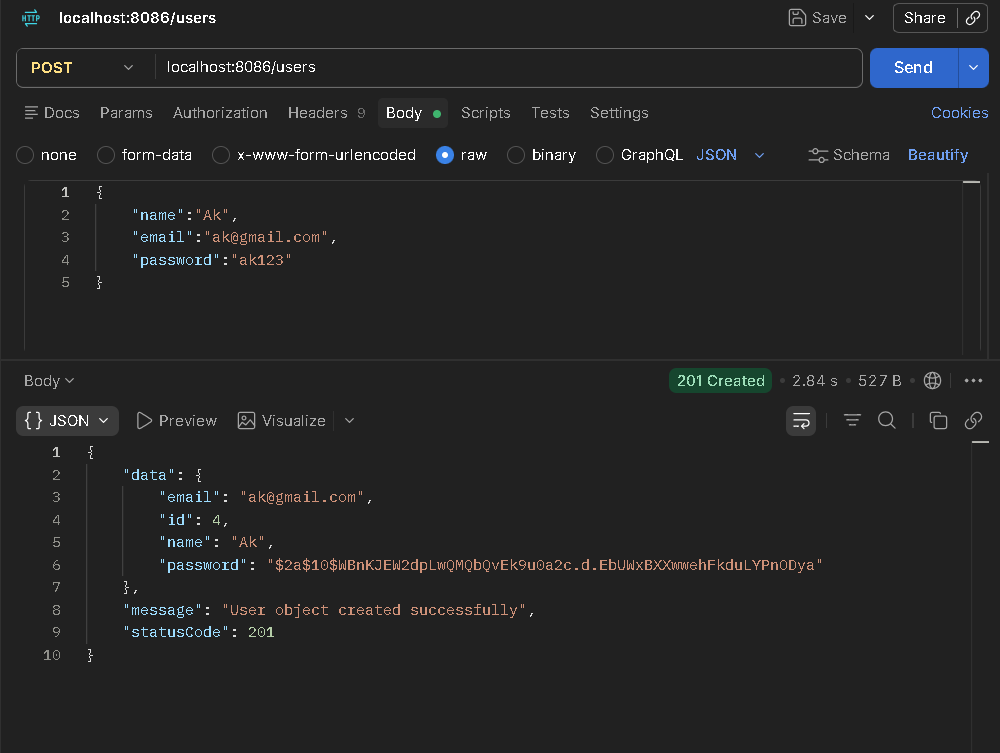
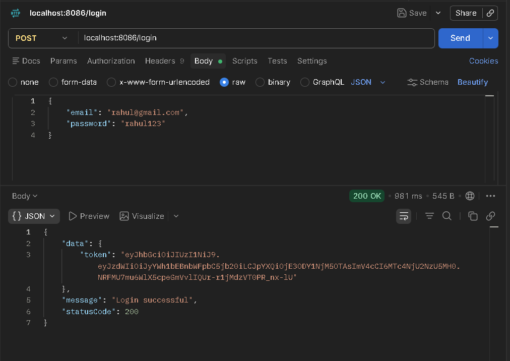
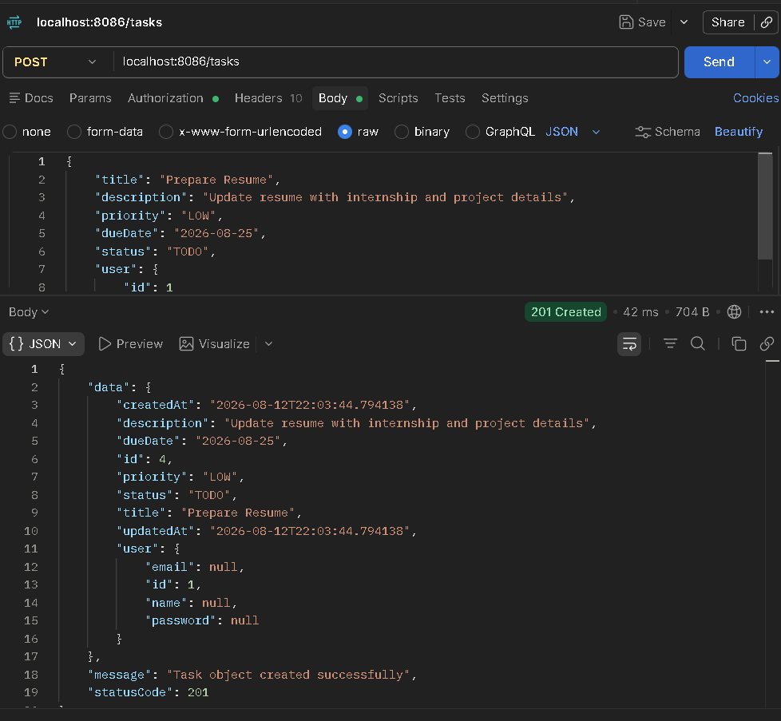
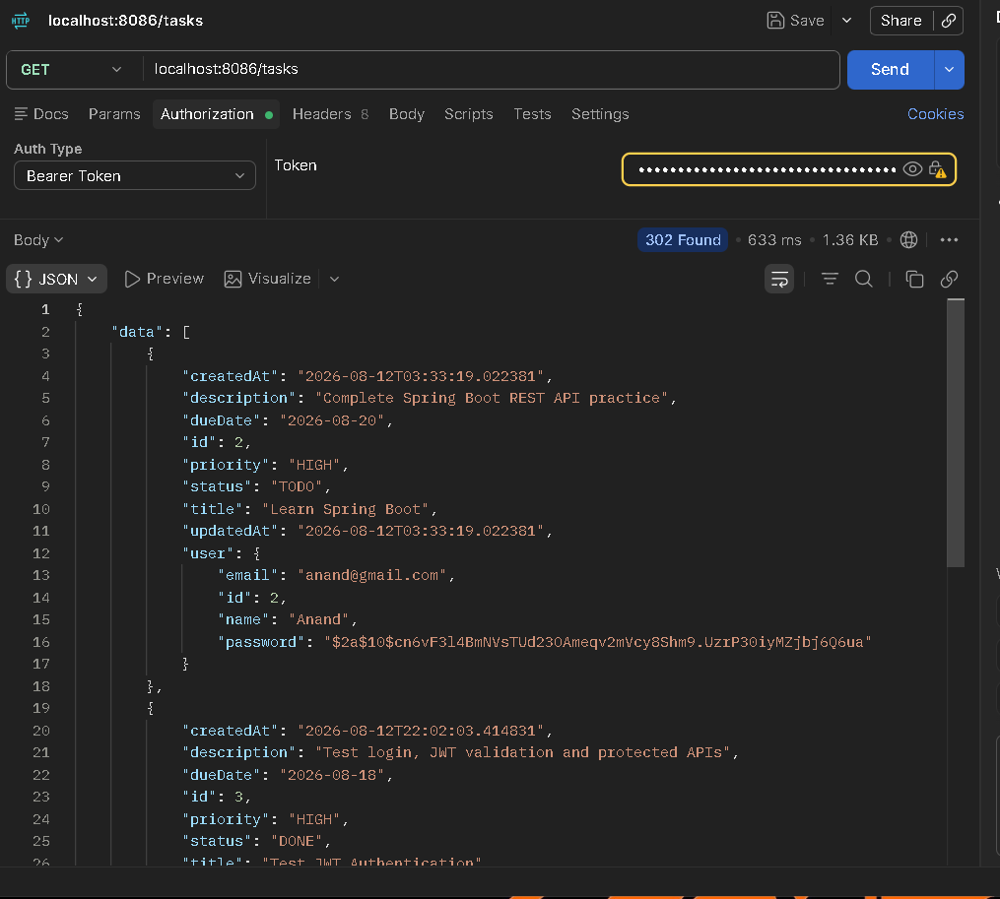
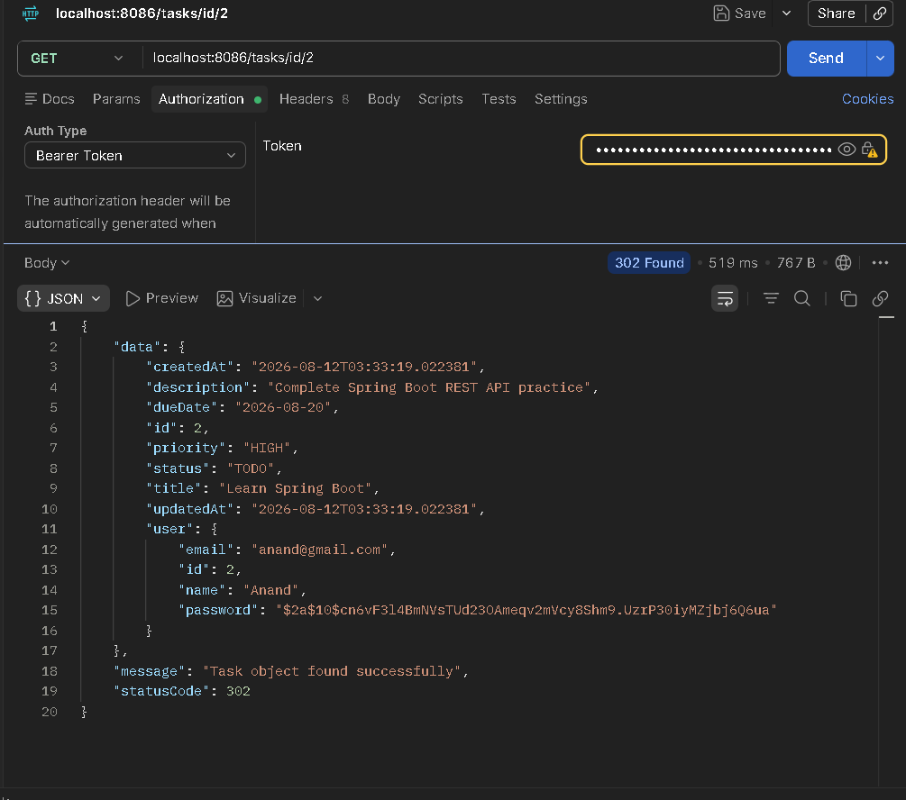
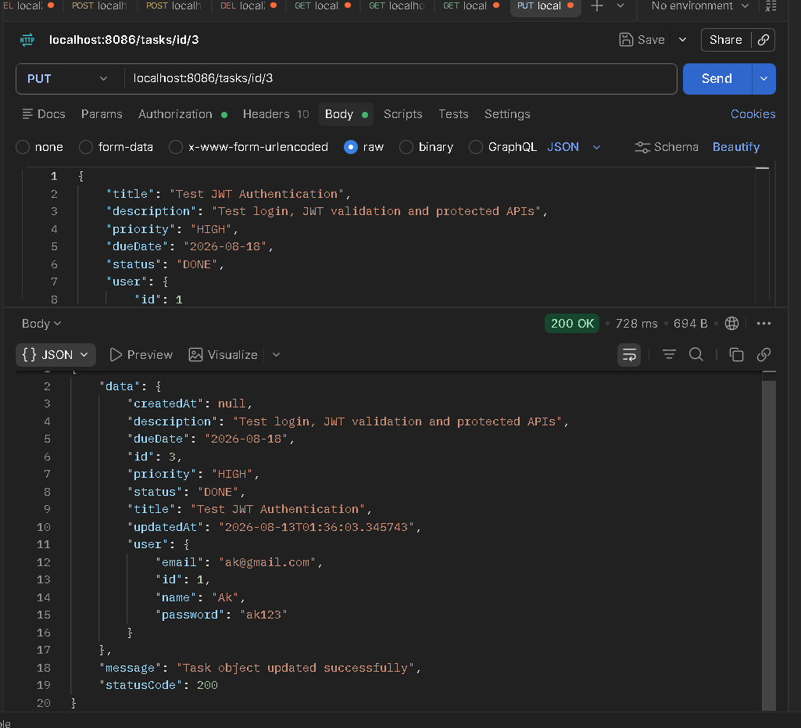
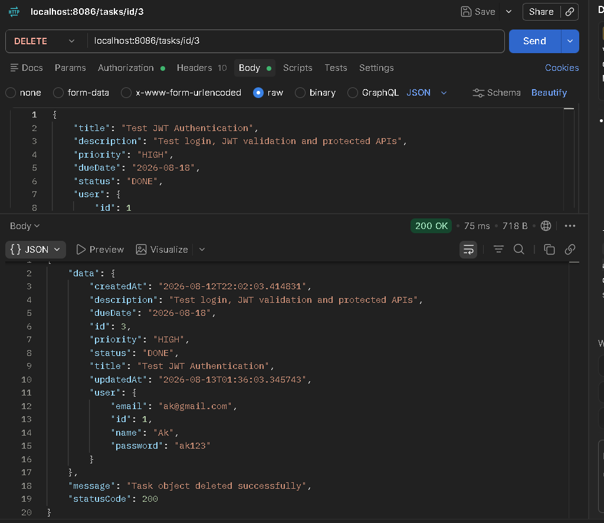

# Task-Management-Portal
# Task Management System

A backend REST API application for managing users and tasks. The application provides user registration, login authentication, password management, and complete CRUD operations for tasks.

## 1. Project Overview

The Task Management System is developed using Spring Boot. It allows users to create, view, update, and delete tasks. User authentication is implemented using password hashing and JWT-based authentication.

The backend follows a layered architecture consisting of:

- Controller
- Service
- Service Implementation
- Repository
- Model/Entity
- Exception Handling
- Security Configuration

---

## 2. Setup Instructions

### Prerequisites

Make sure the following are installed:

- Java 17 or above
- Spring Tool Suite / Eclipse / IntelliJ IDEA
- MySQL
- Maven
- Postman
- Git

### Steps to Run the Project

1. Clone the repository:

```bash
git clone https://github.com/adityakr101/Task-Management-Portal.git

2. Open the project in Eclipse, Spring Tool Suite, or IntelliJ IDEA.
3. Configure the database in:
  src/main/resources/application.properties

Example:
spring.datasource.url=jdbc:mysql://localhost:3306/task_management
spring.datasource.username=root
spring.datasource.password=your_password

spring.jpa.hibernate.ddl-auto=update
spring.jpa.show-sql=true

4. Update the database username and password according to your MySQL configuration.
5. Run the Spring Boot application.
6. The application will start on:
  http://localhost:8086
7. APIs can be tested using Postman.

### 3. Tech Stack Used
Backend
Java
Spring Boot
Spring Web
Spring Data JPA
Hibernate
Spring Security
JWT
BCrypt Password Encoder
Database
MySQL
Tools
Eclipse
Maven
Postman
Git
GitHub

### 4. Architecture Overview

The project follows a layered architecture.
Client (Postman)
       |
       v
Controller Layer
       |
       v
Service Layer
       |
       v
Service Implementation
       |
       v
Repository Layer
       |
       v
MySQL Database

Model Layer

Contains the entity classes:

User
Task
Controller Layer

Handles HTTP requests and responses.

Examples:

UserController
TaskController
Service Layer

Contains the business logic.

Examples:

UserService
TaskService
Service Implementation Layer

Contains the actual implementation of the service methods.

Examples:

UserServiceImpl
TaskServiceImpl
Repository Layer

Communicates with the database using Spring Data JPA.

Examples:

UserRepository
TaskRepository
Exception Handling

Custom exceptions and global exception handling are implemented to provide meaningful error responses.

#### 5. API Endpoints
User APIs

| Method | Endpoint                    | Description          |
| ------ | --------------------------- | -------------------- |
| POST   | `/users`                    | Create a new user    |
| GET    | `/users`                    | Get all users        |
| GET    | `/users/{id}`               | Get user by ID       |
| PUT    | `/users/{id}`               | Update user          |
| DELETE | `/users/{id}`               | Delete user          |

Authentication API

| Method | Endpoint | Description                    |
| ------ | -------- | ------------------------------ |
| POST   | `/login` | Login using email and password |


Task APIs

| Method | Endpoint      | Description       |
| ------ | ------------- | ----------------- |
| POST   | `/tasks`      | Create a new task |
| GET    | `/tasks`      | Get all tasks     |
| GET    | `/tasks/{id}` | Get task by ID    |
| PUT    | `/tasks/{id}` | Update task       |
| DELETE | `/tasks/{id}` | Delete task       |


### 6. Task Entity

Each task contains information such as:

Title
Description
Priority
Due Date
Status
Created At
Updated At
User

Example:

{
    "title": "Complete Java Assignment",
    "description": "Complete the Spring Boot task management project",
    "priority": "HIGH",
    "dueDate": "2026-08-15",
    "status": "TODO",
    "user": {
        "id": 1
    }
}

The createdAt and updatedAt fields are automatically managed using:

@CreationTimestamp
private LocalDateTime createdAt;

@UpdateTimestamp
private LocalDateTime updatedAt;

### 7. Authentication and Password Security

User passwords are not stored as plain text in the database.

BCrypt is used to hash passwords before storing them.

Example:

String encodedPassword = passwordEncoder.encode(password);

During login, the entered password is compared with the stored BCrypt hash.

JWT is used to generate an authentication token after successful login.

Example login request:

{
    "email": "rahul@gmail.com",
    "password": "rahul123"
}

### 8. Exception Handling

The application contains custom exceptions for handling errors such as:

User not found
Task not found
No tasks found
Invalid email
Invalid password

A global exception handler is used to return structured error responses.

Example:

{
    "error": "Invalid Password",
    "errorCode": 401,
    "errorMessage": "Invalid Password"
}

10. Screenshots
User Registration
## Screenshots

### User Registration



### Login



### Create Task



### Get All Tasks



### Get Task By ID



### Update Task



### Delete Task




